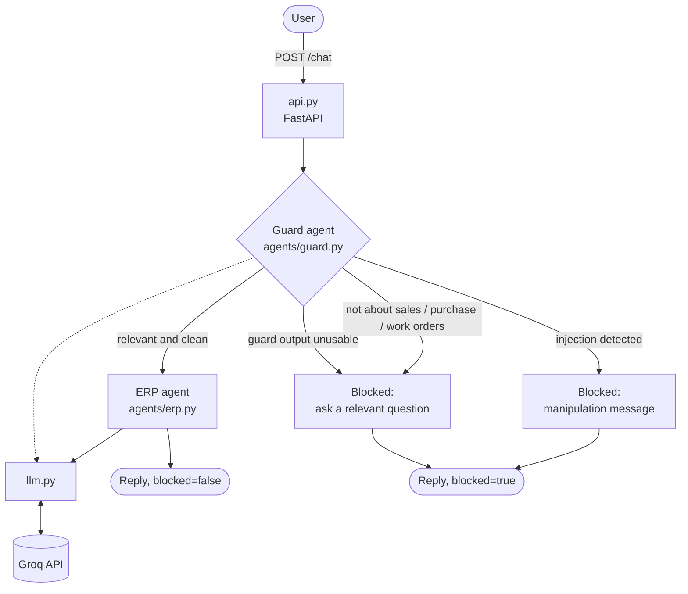

# ERP Copilot

A multi-agent assistant for ERP questions, built with FastAPI and Groq. Every user message goes
through a **guard agent** first; only relevant, clean queries reach the answering agent.

Supported topics: **sales orders**, **purchase orders**, **work orders**.

## Flow



The guard fails closed: if its output cannot be parsed, the message is blocked.

## Project structure

```
erp-copilot/
├── pyproject.toml
├── .env.example
└── src/erp_copilot/
    ├── __init__.py      # entry point: starts the server
    ├── config.py        # settings from .env
    ├── llm.py           # Groq client and chat_completion()
    ├── api.py           # FastAPI app: /health, /chat
    └── agents/
        ├── base.py      # Agent class (name, system prompt, run())
        ├── guard.py     # relevance + prompt-injection check
        └── erp.py       # placeholder answering agent
```

Layers: `api.py` → `agents/` → `llm.py` → Groq. `config.py` is used by all.

## Setup

```bash
cp .env.example .env     # then set GROQ_API_KEY
uv sync
```

| Variable | Default | Purpose |
|---|---|---|
| `GROQ_API_KEY` | required | Groq credentials |
| `GROQ_MODEL` | `llama-3.3-70b-versatile` | Model used by all agents |
| `GROQ_TEMPERATURE` | `0.7` | Default temperature (guard uses 0) |

## Run

```bash
uv run erp-copilot
# or
uv run uvicorn erp_copilot.api:app --reload --port 8000
```

Interactive docs: http://localhost:8000/docs

## API

### `GET /health`
Returns `{"status": "ok"}`.

### `POST /chat`

Request (`message` is 1 to 2000 characters):
```json
{"message": "What is the status of sales order SO-1001?"}
```

Response:
```json
{"agent": "erp", "blocked": false, "reply": "..."}
```

| Case | `agent` | `blocked` | `reply` |
|---|---|---|---|
| Relevant query | `erp` | `false` | Answer from the ERP agent |
| Off-topic query | `guard` | `true` | Asks for a relevant question |
| Injection attempt | `guard` | `true` | Says the message was blocked |

Errors: `422` for invalid input, `502` if Groq fails.

```bash
curl -X POST http://localhost:8000/chat \
  -H "Content-Type: application/json" \
  -d '{"message": "Create a purchase order for 50 units"}'
```

## Roadmap

- Orchestrator that routes relevant queries to specialist agents (sales, purchase, work orders)
- Tests with a mocked Groq client
- Streaming responses
