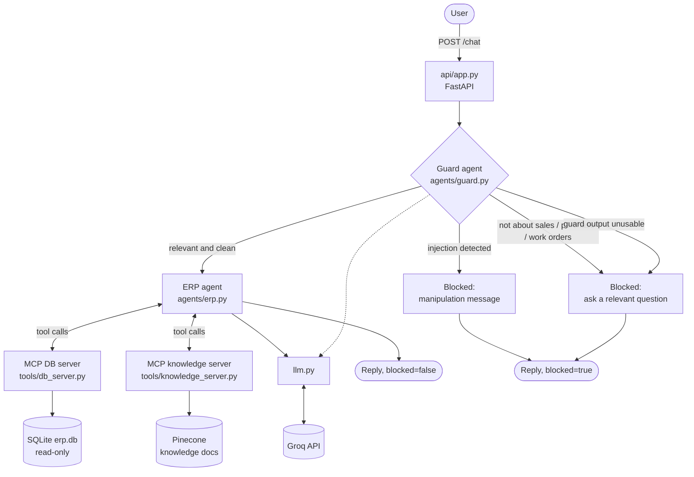

# ERP Copilot

A multi-agent assistant for ERP questions, built with FastAPI and Groq. Every user message goes
through a **guard agent** first; only relevant, clean queries reach the answering agent.

Supported topics: **sales orders**, **purchase orders**, **work orders**.

## Flow



The guard fails closed: if its output cannot be parsed, the message is blocked.

## Project structure

```
erp-copilot/
├── pyproject.toml
├── .env.example
├── knowledge/                 # markdown docs indexed into Pinecone
└── src/erp_copilot/
    ├── __init__.py            # entry point: starts the server
    ├── config.py              # settings from .env (shared)
    ├── llm.py                 # Groq client + tool-calling loop (shared)
    ├── api/                   # HTTP layer
    │   ├── app.py             # FastAPI app: /health, /chat, startup (lifespan)
    │   └── routers/
    │       └── orders.py      # GET /sales-orders, /purchase-orders, /work-orders
    ├── agents/                # the LLM agents
    │   ├── base.py            # Agent class (run, run_with_tools)
    │   ├── guard.py           # relevance + prompt-injection check
    │   └── erp.py             # ERP agent: schema summary prompt + tool rules
    ├── tools/                 # MCP: servers the agent can call, and the client that runs them
    │   ├── client.py          # starts MCP servers, exposes their tools to Groq
    │   ├── db_server.py       # tools: describe_table, run_query
    │   └── knowledge_server.py# tool: search_knowledge
    ├── data/                  # database and sample data
    │   ├── db.py              # SQLite setup + read-only, table-restricted queries
    │   ├── schemas.py         # Pydantic models: SalesOrder, PurchaseOrder, WorkOrder
    │   └── dummy_data.py      # sample orders (seeds the database)
    ├── vector/                # Pinecone knowledge store
    │   ├── store.py           # chunk, upsert, search (integrated embeddings)
    │   └── ingest.py          # loads knowledge/*.md into Pinecone
    └── ui/
        └── app.py             # Streamlit chat UI (calls the API over HTTP)
```

Layers: `api/` → `agents/` → `llm.py` → Groq, with `tools/` giving agents access to `data/` and `vector/`. `config.py` is used by all.

## Setup

```bash
cp .env.example .env     # then set GROQ_API_KEY
uv sync
```

| Variable | Default | Purpose |
|---|---|---|
| `GROQ_API_KEY` | required | Groq credentials |
| `GROQ_MODEL` | `llama-3.3-70b-versatile` | Model used by all agents |
| `GROQ_TEMPERATURE` | `0.7` | Default temperature (guard uses 0) |
| `PINECONE_API_KEY` | optional | Enables knowledge search. Without it the agent only has the DB tools |
| `PINECONE_INDEX` | `erp-knowledge` | Index name (created on first ingest) |

## Run

```bash
uv run erp-copilot
# or
uv run uvicorn erp_copilot.api.app:app --reload --port 8000
```

Interactive docs: http://localhost:8000/docs

### Chat UI (Streamlit)

With the backend running, start the UI in a second terminal:

```bash
uv run streamlit run src/erp_copilot/ui/app.py
```

Open http://localhost:8501. The sidebar shows backend status and example questions. Blocked
messages show as warnings and errors as red boxes. To use another backend, change the URL in the
sidebar or set `ERP_API_URL`.

## API

### `GET /health`
Returns `{"status": "ok"}`.

### `POST /chat`

Request (`message` is 1 to 2000 characters):
```json
{"message": "What is the status of sales order SO-1001?"}
```

Response:
```json
{"agent": "erp", "blocked": false, "reply": "..."}
```

| Case | `agent` | `blocked` | `reply` |
|---|---|---|---|
| Relevant query | `erp` | `false` | Answer from the ERP agent |
| Off-topic query | `guard` | `true` | Asks for a relevant question |
| Injection attempt | `guard` | `true` | Says the message was blocked |

### Order endpoints (dummy data)

| Endpoint | Returns |
|---|---|
| `GET /sales-orders`, `/purchase-orders`, `/work-orders` | List, with optional `?status=` filter |
| `GET /sales-orders/{id}` (same for the others) | One order, or `404` |

Errors: `422` for invalid input, `502` if Groq fails.

```bash
curl -X POST http://localhost:8000/chat \
  -H "Content-Type: application/json" \
  -d '{"message": "Create a purchase order for 50 units"}'
```

## ERP agent and the DB MCP server

The ERP agent answers by querying a SQLite database (`erp.db`, created and seeded from the dummy
data on first start, git-ignored) through an MCP server that the API starts at startup.

- **Prompt:** a curated schema summary (tables, column meanings, business rules, example
  question-to-SQL pairs) lives in `agents/erp.py`.
- **`run_query(sql)`:** a single read-only `SELECT`, max 100 rows. Writes, multiple statements
  and `PRAGMA` are rejected, and a SQLite authorizer blocks any table outside the allow-list.
- **`describe_table(table)`:** fallback for column details the prompt does not cover. Allowed
  tables come from `ERP_ALLOWED_TABLES` (default: the three order tables), so a different role can
  be given a smaller set.

## Knowledge search (Pinecone)

Process and policy questions ("who approves a large purchase order?") are answered from the
markdown files in `knowledge/`, stored in Pinecone and searched by meaning. Pinecone embeds the
text itself (`llama-text-embed-v2`), so no separate embedding key is needed.

```bash
# 1. add PINECONE_API_KEY to .env
uv run erp-ingest        # creates the index if needed and uploads one chunk per "## " section
uv run erp-copilot       # restart the API so the knowledge server starts
```

Re-run `erp-ingest` after editing the docs. Tool choice is guided by the tool descriptions and the
"Tool rules" in the ERP agent prompt: `run_query` for order data, `search_knowledge` for rules and
processes.

## Roadmap

- MCP server wrapping the order GET endpoints (API data fetch)
- Orchestrator that routes relevant queries to specialist agents (sales, purchase, work orders)
- Tests with a mocked Groq client
- Streaming responses
